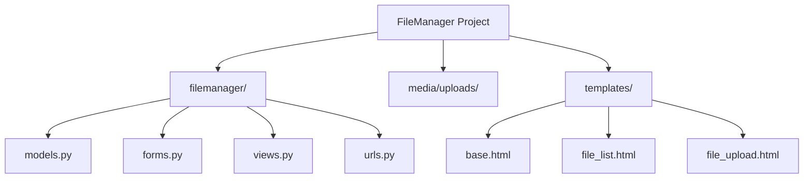
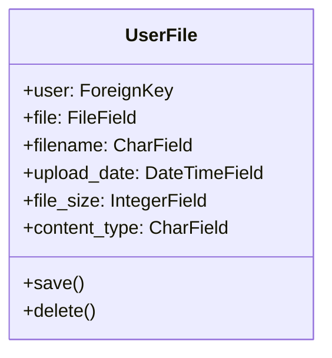

# File Management System Implementation Plan

## 1. Project Structure


## 2. Data Models



## 3. Implementation Plan

### Phase 1: Project Setup
1. Create Django project and app
2. Configure settings.py:
   - Set up media settings
   - Configure authentication
   - Add file size and type restrictions
3. Create initial database migrations

### Phase 2: Authentication
1. Set up Django's built-in authentication system
2. Create login/register templates
3. Configure authentication URLs
4. Add login_required decorators to views

### Phase 3: File Management Implementation
1. Create UserFile model
2. Implement file upload form with validation:
   - File size limit (5MB)
   - File type restrictions (.jpg, .png, .pdf, .docx)
3. Create views:
   - File upload view
   - File list view
   - File download view
   - File delete view
4. Create templates:
   - Base template with navigation
   - File upload form
   - File list with download/delete buttons

### Phase 4: File Operations
1. Implement file upload handling:
   - Validate file size and type
   - Store in media/uploads/
   - Create database entry
2. Implement file deletion:
   - Add confirmation dialog
   - Remove file from storage
   - Delete database entry
3. Implement file download functionality

### Phase 5: Security & Validation
1. Add CSRF protection
2. Implement file type validation
3. Add user permission checks
4. Sanitize filenames
5. Add error handling

## 4. Technical Specifications

### File Validation
- Maximum file size: 5MB
- Allowed file types: .jpg, .png, .pdf, .docx
- File naming: Sanitized and unique

### Security Measures
- User authentication required
- CSRF protection
- File type validation
- Secure file storage

### URL Structure
```
/login/                 - User login
/logout/                - User logout
/register/              - User registration
/files/                 - File list view
/files/upload/          - File upload
/files/<int:pk>/delete/ - File deletion
/files/<int:pk>/download/ - File download
```

## 5. Testing Strategy
1. Unit tests:
   - Model validation
   - Form validation
   - View functionality
2. Integration tests:
   - File upload process
   - File deletion process
   - Authentication flow
3. Security tests:
   - Unauthorized access attempts
   - File type validation
   - Size limit validation